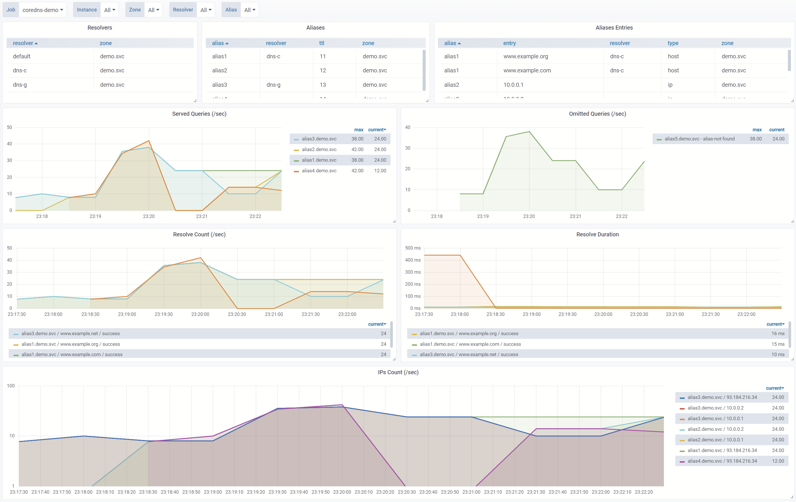

# `recursor` - CoreDNS Plugin  

The `recursor` resolves domains using defined IP addresses or resolving other mapped domains using defined resolvers. 

## Use Case


## Config Syntax / Examples

The `recursor` definition:
- `zone` - DNS zone for the recursor
- `verbose` - stdout logs level: 
  - `0` - minimal
  - `1` - middle
  - `2` - talkative
- `resolvers` - other DNS servers:
  - *map-key/id*: name of resolver, `default` overrides system default resolver  
  - `urls`: list of URL addresses, example: `udp://127.0.0.1:53` (system default is represented by `://default`)
  - `timeout_ms`: resolver connection timeout in millisecods 
- `aliases` - domain aliases:
    - *map-key/id*: name of alias, subdomain or `*` if you want the recursor to be a DNS repeater
    - `ips`: IP addresses to return as a part of answer
  - `hosts`: domains to be resolved so that the IP addresses obtained in this way will be returned as a part of answer
  - `resolver_name`: the defined resolver reference, default is... `default` of course :)
  - `ttl`: DNS record Time To Live in seconds

#### Corefile

```txt
recursor {   
    [external-yaml config-file-path]
    [external-json config-file-path]

    [verbose 0..2]
    zone: demo.svc
    resolver dns-c {
        urls udp://1.1.1.1:53 udp://1.0.0.1:53
        timeout_ms 500
    }
    resolver dns-g {
        urls udp://8.8.8.8:53 udp://8.8.4.4:53
    }  
    resolver demo {
        urls udp://10.0.0.1:53
    }  
    alias alias1 {
        hosts www.example.org www.example.com
        resolver_name dns-c
        ttl 11
    }
    alias alias2 {
        ips 10.0.0.1 10.0.0.2
        ttl 12
    }
    alias alias3 {
        ips 10.0.0.1 10.0.0.2
        hosts www.example.net
        resolver_name dns-g
        ttl 13
    }
    alias alias4 {
        hosts www.example.net
        ttl 14
    }  

    alias * {
        resolver_name demo
        ttl 15
    }  
}
```

#### External YAML

```yaml
        zone: demo.svc
        resolvers:
          dns-c:
            urls: [ udp://1.1.1.1:53, udp://1.0.0.1:53 ]
            timeout_ms: 500
          dns-g:
            urls: [ udp://8.8.8.8:53, udp://8.8.4.4:53 ]
          demo:
            urls: [ udp://10.0.0.1:53 ]
        aliases:
          alias1:
            hosts: [ www.example.org, www.example.com ]
            resolver_name: dns-c
            ttl: 11
          alias2:
            ips: [ 10.0.0.1, 10.0.0.2 ]
            ttl: 12
          alias3:
            ips: [ 10.0.0.1, 10.0.0.2 ]
            hosts: [ www.example.net ]
            resolver_name: dns-g
            ttl: 13
          alias4:
            hosts: [ www.example.net ]
            ttl: 14
          "*":
            resolver_name: demo
            ttl: 15
```

#### External JSON

```json
{
  "zone": "demo.svc",
  "resolvers": {
    "dns-c": {
      "urls": [ "udp://1.1.1.1:53", "udp://1.0.0.1:53" ],
      "timeout_ms": 500
    },
    "dns-g": {
      "urls": [ "udp://8.8.8.8:53", "udp://8.8.4.4:53" ]
    },
    "demo": {
      "urls": [ "udp://10.0.0.1:53" ]
    }
  },
  "aliases": {
    "alias1": {
      "hosts": [ "www.example.org", "www.example.com" ],
      "resolver_name": "dns-c",
      "ttl": 11
    },
    "alias2": {
      "ips": [ "10.0.0.1", "10.0.0.2" ],
      "ttl": 12
    },
    "alias3": {
      "ips": [ "10.0.0.1", "10.0.0.2" ],
      "hosts": [ "www.example.net" ],
      "resolver_name": "dns-g",
      "ttl": 13
    },
    "alias4": {
      "hosts": [ "www.example.net" ],
      "ttl": 14
    },
    "*": {
      "resolver_name": "demo",
      "ttl": 15
    }
  }
}
```

#### [More examples](examples)

## Metrics

- [Definition](metrics.go)
- [Grafana Dashboard](docs/dashboard.json)




## Run It

### Build It

```bash
#!/usr/bin/env bash

set -eux
# Extract coredns source code
tar xzvf coredns.src.tar.gz
pushd coredns
  # Add external plugins
  go get github.com/kinjelom/coredns-recursor@latest
  echo -e "recursor:github.com/kinjelom/coredns-recursor" >> plugin.cfg
  # Build
  go generate
  go build
  ./coredns -plugins
popd
```
### Deployments Ready to Use

- [BOSH Release](https://github.com/kinjelom/coredns-boshrelease)
- [Kubernetes](https://github.com/kinjelom/coredns-k8s)

## Try it

Helpful commands:
```bash
dig alias1.demo.svc @127.0.0.1 -p 1053
nslookup -port=1053 -debug -type=A alias2.demo.svc 127.0.0.1
```
